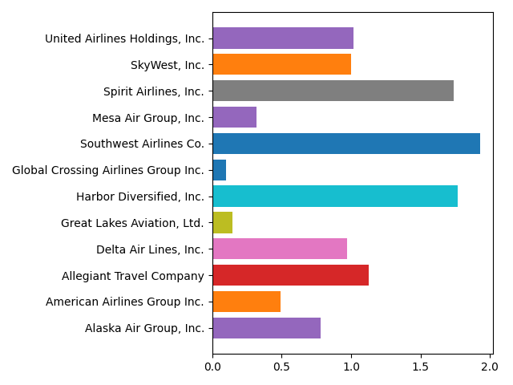
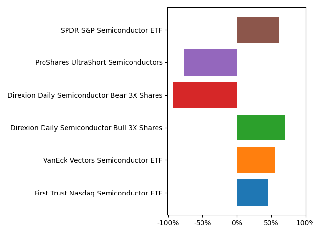

# Finance Database
As a private investor, the sheer amount of information that can be found on the internet is rather daunting. Trying to 
understand what type of companies or ETFs are available is incredibly challenging with there being millions of
companies amd derivatives available on the market. Sure, the most traded companies and ETFs can quickly be found
simply because they are known to the public (for example, Microsoft, Tesla, S&P500 ETF or an All-World ETF). However, 
what else is out there is often unknown.

**This database tries to solve that**. It features 180.000+ symbols containing Equities, ETFs, Funds, Indices, Futures, 
Options, Currencies, Cryptocurrencies and Money Markets. It therefore allows you to obtain a broad overview of sectors,
industries, types of investments and much more.

The aim of this database is explicitly _not_ to provide up-to-date fundamentals or stock data as those can be obtained 
with ease (with the help of this database) by using [FundamentalAnalysis](https://github.com/JerBouma/FundamentalAnalysis) 
or [yfinance](https://github.com/ranaroussi/yfinance). Instead, it gives  insights into the products that exist in each 
country, industry and sector and gives the most essential information about each product. With this information, you 
can analyse specific areas of the financial world and/or find that product that is hard to find. See for examples
on how you can combine this database, and the earlier mentioned packages the section [Examples](#Examples).

Some key statistics of the database:

| Product           | Quantity  | Sectors   | Industries    | Countries | Exchanges |
| ----------------- | --------- | --------- | ------------- | --------- | --------- |
| Equities          | 84.091    | 16        | 262           | 109       | 79        |
| ETFs              | 15.892    | 268*      | 88*           | 100**     | 44        |
| Funds             | 34.947    | 857*      | 416*          | 100**     | 25        |

| Product           | Quantity  | Exchanges |
| ----------------- | --------- | --------- |
| Indices           | 24.548    | 62        |
| Currencies        | 2.529     | 2         |
| Cryptocurrencies  | 3.624     | 1         |
| Options           | 13.819    | 1         |
| Futures           | 1.173     | 7         |
| Money Markets     | 1.384     | 2         |

\* These numbers refer to families (iShares, Vanguard) and categories (World Stock, Real Estate) respectively.  
\** This is an estimation. Obtaining the country distribution can only be done by collecting data on the underlying 
or by manual search.

## Usage
To access the database you can download the entire repository, but I strongly recommend making use of the package 
closely attached to the database. It allows you to select specific json files as well as search through collected
data with a specific query.

You can install the package with the following steps:
1. `pip install FinanceDatabase`
    - Alternatively, download the 'Searcher' directory.
2. (within Python) `import FinanceDatabase as fd`

The package has the following functions:
- `show_options(product, equities_selection=None)` - gives all available options from the below functions per 
  product (i.e. Equities, Funds) which then can be used to collect the data. You can select a sub selection of 
  equities by entering 'countries', 'sectors' or 'industries' for equities_selection.
- `select_cryptocurrencies(cryptocurrency=None)` - with no input gives all cryptocurrencies, with input gives 
the cryptocurrency of choice.
- `select_currencies(currency=None)` - with no input gives all currencies, with input gives 
the currency of choice.
- `select_etfs(category=None)` - with no input gives all etfs, with input gives all etfs of a 
specific category.
- `select_equities(country=None, sector=None, industry=None)` - with no input gives all equities, with input 
gives all equities of a country, sector, industry or a combination of the three.
- `select_funds(category=None)` - with no input gives all funds, with input gives all funds of a 
specific category.
- `select_indices(market=None)` - with no input gives all indices, with input gives all funds of a 
specific market which usually refers to indices in a specific country (like de_market gives DAX).
- `select_other(product)` - gives either all Futures, all Moneymarkets or all Options.
- `search_products(database, query, new_database=None)` - with input from the above functions, this function searching
for specific values in the summary of the product (i.e. the query 'sustainable')
  
If you want additional information about each function you can use the build-in help function of Python. For 
example `help(show_options)` returns a general description, the possible input parameters and the what is returned 
as output.

## Examples
This section gives a few examples of the possibilities with this package. These are merely a few of the things you
can do with the package, and it only uses yfinance. **As you can obtain a wide range of symbols, pretty much any package 
that requires symbols should work.**

### United States' Airlines
If I wish to obtain all companies within the United States listed under 'Airlines' I can write the 
following code:
````
import FinanceDatabase as fd

airlines_us = fd.select_equities(country='United States', industry='Airlines')
````
Then, I can use packages like [yfinance](https://github.com/ranaroussi/yfinance) to quickly collect data from 
Yahoo Finance for each symbol in the industry like this:
````
from yfinance.utils import get_json
from yfinance import download

airlines_us_fundamentals = {}
for symbol in airlines_us:
    airlines_us_fundamentals[symbol] = get_json("https://finance.yahoo.com/quote/" + symbol)

airlines_us_stock_data = download(list(airlines_us))
```` 
With a few lines of code, I have collected all data from a specific industry within the United States. From here on 
you can compare pretty much any key statistic, fundamental data and stock data. For example, let's plot a simple bar 
chart that gives insights in the Quick Ratios (indicator of the overall financial strength or weakness of a company):
````
import matplotlib.pyplot as plt

for symbol in airlines_us_fundamentals:
    quick_ratio = airlines_us_fundamentals[symbol]['financialData']['quickRatio']
    long_name = airlines_us_fundamentals[symbol]['quoteType']['longName']

    if quick_ratio is None:
        continue

    plt.barh(long_name, quick_ratio)

plt.tight_layout()
plt.show()
``````
Which results in the graph displayed below (as of the 3rd of February 2021). From this graph you could identify 
companies that currently lack enough assets to cover their liabilities (quick ratio < 1), and those that do have enough
assets (quick ratio > 1). Both too low and too high could make you wonder whether the company adequately manages 
its assets.



### Semiconductors ETFs
If I wish to obtain all ETFs that have something to do with 'semiconductors' I can use the search function which works
as follows:
````
import FinanceDatabase as fd

all_etfs = fd.select_etfs()
semiconductor_etfs = fd.search_products(all_etfs, 'semiconductor')
````
The variable semiconductor_etfs returns all etfs that have the word 'semiconductor' in their summary which usually also 
corresponds to the fact they are targeted around semiconductors. Next, I collect data:
````
semiconductor_etfs_fundamentals = {}
for symbol in semiconductor_etfs:
    semiconductor_etfs_fundamentals[symbol] = get_json("https://finance.yahoo.com/quote/" + symbol)
````
And lastly, I have a look at the YTD returns (as of the 3rd of February 2021) of each ETF to understand which ones 
might be outperforming the others:
````
for symbol in semiconductor_etfs_fundamentals:
    ytd_return = semiconductor_etfs_fundamentals[symbol]['fundPerformance']['trailingReturns']['ytd']
    long_name = semiconductor_etfs_fundamentals[symbol]['quoteType']['longName']

    if ytd_return is None:
        continue

    plt.barh(long_name, ytd_return)

plt.tight_layout()
plt.xticks([-1, -0.5, 0, 0.5, 1], ['-100%', '-50%', '0%', '50%', '100%'])
plt.show()
````
This results in the following graph which gives _some_ insights in the available semiconductor ETFs. Then with the 
large amount of fundamentals data you can figure out how each ETF differs and what might be worthwhile to invest in.



## Contribution
Projects are bound to have (small) errors and can always be improved. Therefore, I highly encourage you to submit 
issues and create pull requests to improve the package.

The last update to the database is the 3rd of February 2021. I always accept Pull Requests every few months 
to keep the database up to date. Extending the amount of tickers and data is also much appreciated.